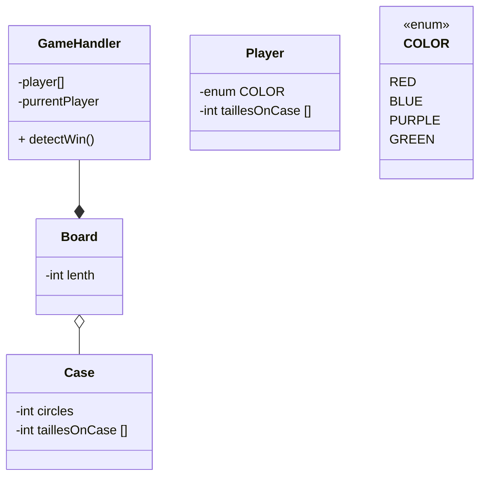

# Diagramme de classes TP-OTRIO

```mermaid

classDiagram 

    class GameHandler {
        -player[]
        -purrentPlayer
        + detectWin()
    } 
     

    class Board {
        -int lenth
    } 

    GameHandler --* Board

    class Case {
        -int circles 
        -int taillesOnCase []
    }
 
    Board o-- Case

    class Player {
        -enum COLOR 
        -int taillesOnCase []
    }

    class  COLOR {
    <<enum>>

        RED
        BLUE
        PURPLE
        GREEN
    }

```

### BE CAREFUL WITH THIS 

int -> uint...

MAJ au debut des type qu'on créer exemple : Player

MAJ aux debut des methodes

Nom des variables en minuscule

