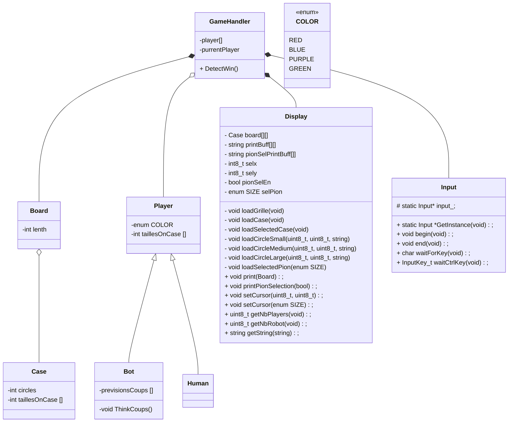

# Diagramme de classes TP-OTRIO

### BE CAREFUL WITH THIS 

int -> uint...

MAJ au debut des type qu'on créer exemple : Player

MAJ aux debut des methodes

Nom des variables en minuscule

### Détail des classes
**Classe GameHandler**
- 
La classe GameHandler permet d'orchestrer le jeu.

Elle a comme attribut `players` étant un vecteur de pointeur de `Player`. Elle a `currentPlayer` étant l'index du joueur courant du vecteur players et `board` étant le plateau de jeu
Elle contient une méthode `start` permettant de démarrer une partie de 0Trio et d'y jouer.  

  
**Classe Player**
-
La classe Player défini un joueur (humain ou robot) du jeu 0trio.  
La classe défini également une enumération et une structure importantes au déroulement du jeu, `playerAction_t` et `cursor_t`
#### playerAction_t
C'est une énumération permettant de récupérer ce que fait le joueur afin de gérer l'affichage correctement.
- ENDPLAY indique que le joueur a fini de jouer.
- ARROW indique que le joueur vient de se déplacer.
- PION_SEL_ENABLE indique que le joueur est en mode sélection de pion.
- PION_SEL_DISABLE indique que le joueur vient de quitter le mode de sélection de pion.

#### cursor_t
C'est une structure permettant de gérer le curseur du joueur qui se déplace dans le terminale. Elle est composée des attributs suivants:
- x, est la position x dans le terminale
- y, est la position y dans le terminale
- s, est la taille du pion choisit
- c, est la couleur du pion

La classe player contient également comme attributs, le `nom` qui est le nom du joueur, `color` qui est la couleur du joueur et `stock` qui est le stock de pion du joueur.  
Player a comme méthodes `hasPion` vérifiant si le joueur à tel pion en stock (basée sur la taille et la couleur) et `usePion` lui faisant utilisé un pion.
La classe Player est parente de `Bot` et `Human` et contient une méthode purement virtuelle `playTurn`.

**Classe Bot**
- 
La classe Bot permet de définir un robot du jeu 0trio, elle hérite de `Player`.

**Classe Human**
- 
La classe Human défini un joueur humain du jeu 0trio, elle hérite de `Player`.
Elle redéfinit la méthode `playTurn` qui correspond une action de jeu du joueur par exemple:
- Déplacement dans le choix d'un pion
- Choix d'un pion
- Déplacement dans le tableau
- Utilisation d'un pion
On cette fonction après chaque action listé ci-dessus. On arrête lorsqu'un pion est utilisé. C'est la structure `playerAction_t` qui le signifie en renvoyant `ENDPLAY`.

**Classe Display**
- 
La classe Display définit l'affichage dans le terminale du jeu 0trio.  
Elle nous permet d'afficher le tableau de jeu et le choix des pions. 

**Classe Input**
- 
La classe Input permet de récupérer les inputs d'un joueur dans le terminale.

**Classe Board**
- 
La classe Board permet de définir le tableau de jeu grâce à son attribut `cases` étant une matrice de Case. La classe à également un getter de case permettant de récupérer une case du tableau en fonction de X ∈ [0, 2] et Y ∈ [0, 2].

**Classe Case**
-
La classe Case permet de définir une case du plateau de jeu (`Board`).  
Une case contient sa position (x, y) et un vecteur de Pion où:
- Index 0 =  Petit pion
- Index 1 = Moyen pion
- Index 2 = Grand pion

A l'instanciation, le vecteur pion contient uniquement des nullptr.  
Les méthodes `addPion` et `deletePion` permettent respectivement d'ajouter et supprimer un pion de ce vecteur. 

**Structure Pion**
-
La structure Pion défini un pion du jeu. Cette structure à comme propriété:
- Color, étant la couleur du pion
- Size, étant la taille du pion

**Enum Color**
-
L'énumération Color permet de défini les quatres couleurs utilisése par le jeu 0trio.  
Ces couleurs étant:
- Rouge
- Vert
- Bleu
- Violet

**Enum Size**
-
L'énumération Size permet de défini les trois tailles utilisées par le jeu 0trio.  
Ces tailles étant:
- Petit (small)
- Moyen (medium)
- Grand (large)