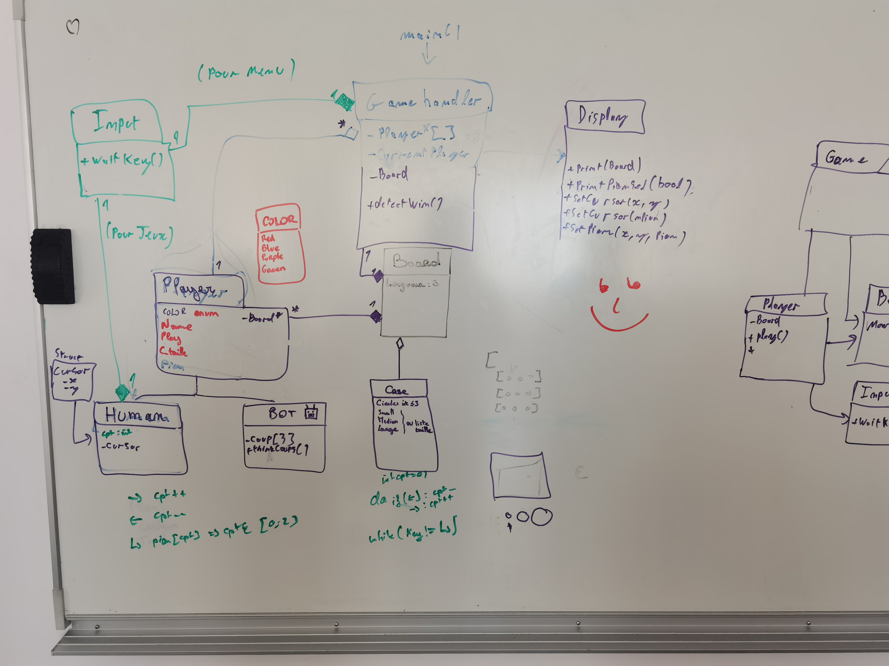

# CPP - TP4 Noté

- Eugénie
- Annabelle
- Jack
- Nathan
- Thomas


## Build

Create build dir
```bash
mkdir build
```

Compile
```bash
cmake -Bbuild
cmake --build build/
```

Run default
```bash
./build/CPP_TP6
```

## Méthode de travail

Schéma reflexion :


